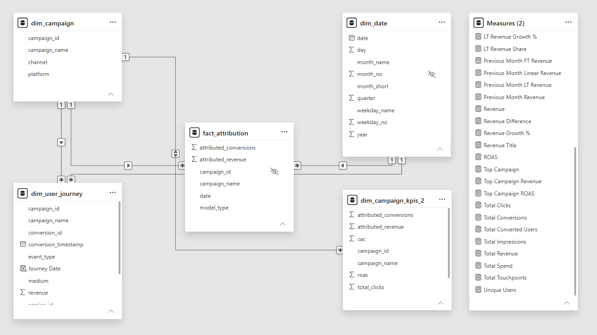
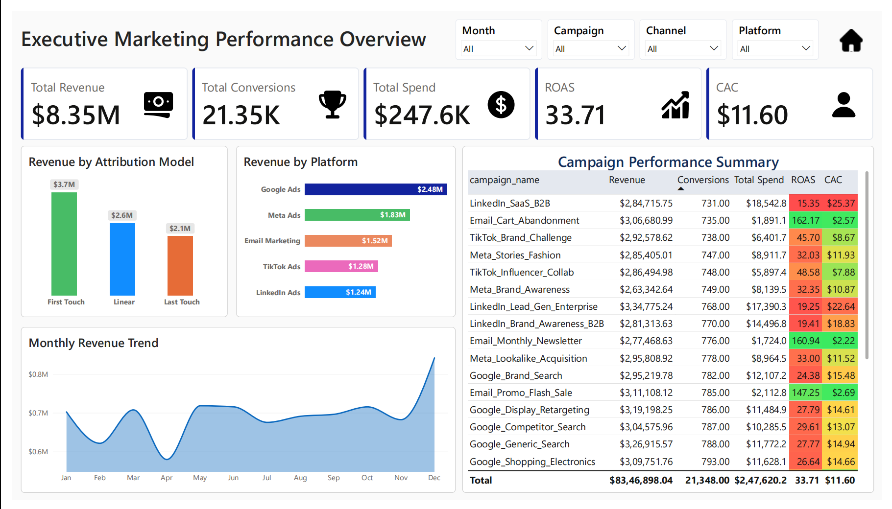
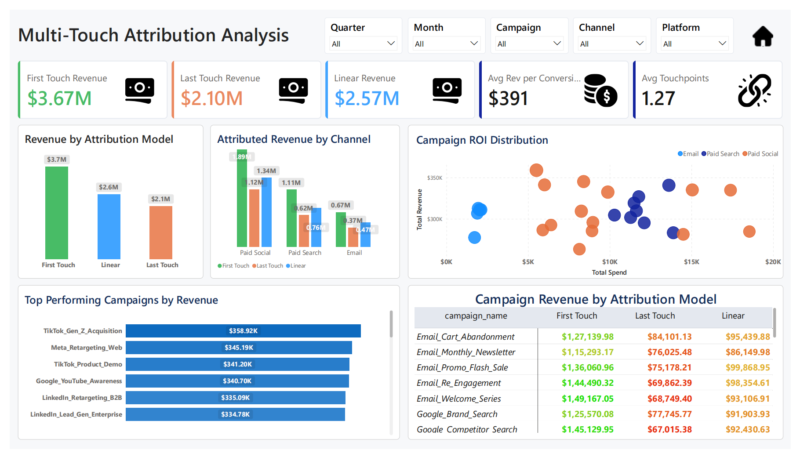
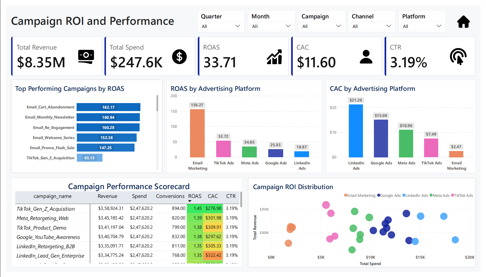
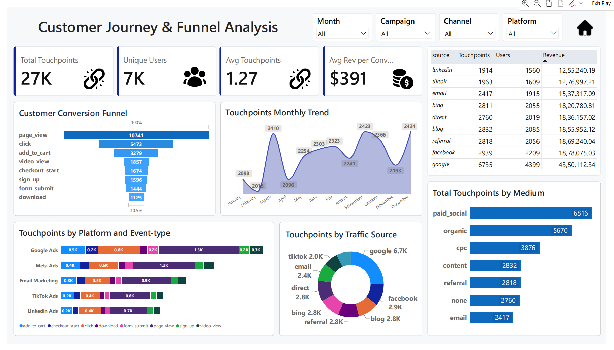

# 📊 Multi-Touch Marketing Attribution & ROI Dashboard

> **An End-to-End Business Intelligence Project**  
> Built using **Python, PostgreSQL, SQL, and Microsoft Power BI** to analyze customer journeys, implement multi-touch attribution models, and measure marketing ROI.

---

## 📌 Project Overview

Modern businesses invest heavily in digital marketing across multiple channels such as **Google Ads, Meta Ads, TikTok, LinkedIn, and Email Marketing**. However, customers rarely convert after a single interaction. They typically engage with multiple campaigns before making a purchase.

Traditional **Last-Click Attribution** assigns all conversion credit to the final interaction, often leading to poor marketing decisions and inefficient budget allocation.

This project develops a **Multi-Touch Marketing Attribution Engine** that fairly distributes conversion credit across the customer journey using multiple attribution models and provides interactive Power BI dashboards for marketing performance analysis.

---

## 🎯 Business Objectives

- Build an end-to-end marketing analytics solution.
- Reconstruct customer journeys from multiple datasets.
- Implement First Touch, Last Touch, and Linear Attribution models.
- Calculate key marketing KPIs.
- Evaluate campaign performance and marketing efficiency.
- Build an executive-level Power BI dashboard for data-driven decision making.

---

## 🛠 Tech Stack

| Technology | Purpose |
|------------|----------|
| **Python (Pandas)** | Data Cleaning & Exploratory Data Analysis |
| **PostgreSQL** | Data Storage & SQL Queries |
| **SQL** | Attribution Logic & KPI Calculation |
| **Power BI** | Interactive Dashboard Development |
| **Microsoft Word** | Executive Report |
| **GitHub** | Version Control & Documentation |

---

# 📂 Dataset

The project integrates three datasets representing different stages of the marketing lifecycle.

### 1️⃣ Ad Spend Dataset

Contains advertising campaign performance including:

- Campaign ID
- Campaign Name
- Platform
- Channel
- Spend
- Clicks
- Impressions

---

### 2️⃣ User Touchpoints Dataset

Captures every customer interaction before conversion.

Includes:

- User ID
- Session ID
- Timestamp
- Source
- Medium
- Campaign
- Event Type

---

### 3️⃣ Conversion Dataset

Stores completed customer conversions.

Includes:

- Conversion ID
- User ID
- Conversion Timestamp
- Revenue

---

# 🔄 Project Workflow

```text
Raw Marketing Data
        │
        ▼
Python Data Cleaning & EDA
        │
        ▼
PostgreSQL Database
        │
        ▼
Advanced SQL Attribution Logic
        │
        ▼
Star Schema Data Modeling
        │
        ▼
Power BI Data Model
        │
        ▼
Interactive Executive Dashboards
```

---

# 🧹 Data Preprocessing

The datasets were cleaned using Python.

Tasks performed:

- Missing value handling
- Duplicate removal
- Timestamp standardization
- Data type validation
- Dataset consistency checks
- Exploratory Data Analysis (EDA)

---

# 🗄 SQL Implementation

Advanced SQL techniques were used to build the attribution engine.

### Key SQL Concepts

- INNER JOIN
- Window Functions
- Common Table Expressions (CTEs)
- Views
- Aggregations
- CASE Expressions
- Star Schema Modeling

---

## Attribution Models Implemented

### First Touch Attribution

Assigns 100% conversion credit to the customer's first interaction.

---

### Last Touch Attribution

Assigns 100% conversion credit to the final interaction before conversion.

---

### Linear Attribution

Evenly distributes conversion credit across all customer touchpoints.

---

# ⭐ Star Schema

The reporting model consists of:

### Fact Table

- Fact Attribution

### Dimension Tables

- Dim Campaign
- Dim Date

This model was optimized for Power BI reporting and DAX calculations.



---

# 📈 Marketing KPIs

The following KPIs were calculated:

- Total Revenue
- Total Marketing Spend
- Total Conversions
- Return on Ad Spend (ROAS)
- Customer Acquisition Cost (CAC)
- Cost Per Click (CPC)
- Click Through Rate (CTR)
- Average Revenue per Conversion
- Average Touchpoints per Conversion

---

# 📊 Power BI Dashboards

## 🏠 Landing Page

Provides navigation to all report pages with project overview and quick access buttons.

---

## 📊 Dashboard 1 — Executive Marketing Performance


**Purpose**

Provides a high-level overview of marketing performance.

### Highlights

- Revenue
- Spend
- ROAS
- CAC
- Revenue Trend
- Revenue by Channel
- Campaign Performance Summary

---

## 📈 Dashboard 2 — Multi-Touch Attribution Analysis


**Purpose**

Compare attribution models.

### Highlights

- First Touch Revenue
- Last Touch Revenue
- Linear Attribution Revenue
- Revenue by Attribution Model
- Revenue by Channel
- Top Performing Campaigns
- Campaign Comparison Matrix

---

## 💰 Dashboard 3 — Campaign ROI & Performance


**Purpose**

Analyze campaign profitability and marketing efficiency.

### Highlights

- ROAS Analysis
- CAC Analysis
- Campaign Performance Scorecard
- ROI Scatter Plot
- Platform Comparison

---

## 👥 Dashboard 4 — Customer Journey & Funnel Analysis


**Purpose**

Understand customer behavior before conversion.

### Highlights

- Conversion Funnel
- Monthly Touchpoint Trend
- Traffic Source Analysis
- Marketing Medium Analysis
- Customer Journey Summary

---

# 📊 Key Business Insights

- First Touch Attribution allocated the highest revenue, emphasizing the importance of early customer interactions.
- Paid Social generated the highest attributed revenue across attribution models.
- Email Marketing achieved the highest ROAS while maintaining the lowest CAC.
- LinkedIn Ads recorded the highest acquisition cost, indicating optimization opportunities.
- High-performing campaigns consistently outperformed platform averages.
- The largest customer drop-off occurred immediately after the Page View stage.
- Google generated the highest customer engagement and attributed revenue.
- Marketing spend alone does not guarantee higher returns; campaign efficiency is a stronger performance indicator.

---

# 💡 Business Recommendations

- Use multi-touch attribution instead of relying solely on last-click attribution.
- Increase investment in high-performing Paid Social and Email Marketing campaigns.
- Optimize LinkedIn campaigns through improved audience targeting and bidding strategies.
- Improve landing page experience to reduce early-stage funnel drop-offs.
- Allocate budgets based on ROAS and CAC rather than advertising spend alone.
- Continuously monitor campaign performance using interactive dashboards.

---

# 📚 Project Deliverables

- ✅ Python Data Cleaning Notebook
- ✅ PostgreSQL Database
- ✅ SQL Attribution Engine
- ✅ Star Schema Data Model
- ✅ Power BI Dashboard
- ✅ Executive Report
- ✅ GitHub Documentation

---

# 👨‍💻 Author

**Yusuf Bahrainwala**

---

## ⭐ If you found this project helpful, consider giving it a Star!
